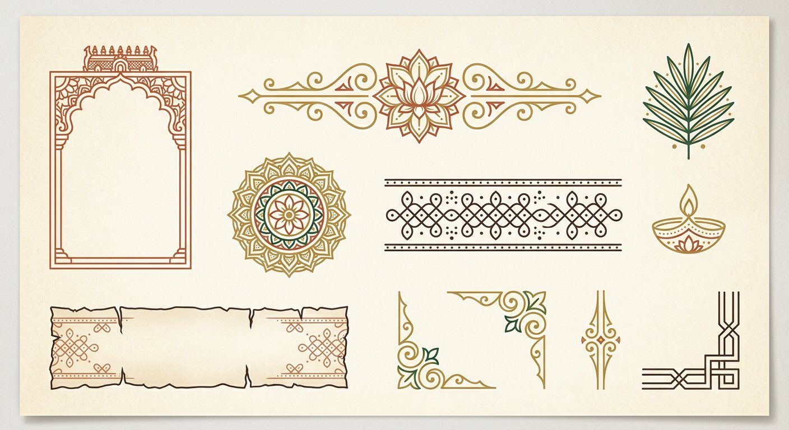

# UI/UX improvement proposal — ancient theme, accessibility, and product gaps

*Prepared 28 September 2026 · scope: presentation layer only (`index.html`, `css/styles.css`,
`js/app.js`, `js/companion.js`, `assets/`, `manifest.webmanifest`)*

This document answers three questions:

1. **How can the app look more advanced**, with a genuinely *ancient* graphic identity?
2. **How do we improve accessibility** — with concrete, measured findings, not vague advice?
3. **Where is the application lacking**, and what should we build next?

Every finding below comes from a line-level review of the current code, and all contrast
numbers were computed from the actual color tokens in `css/styles.css` (WCAG 2.1 relative
luminance formula). Two generated concept images are included under `docs/images/` to make
the graphic direction discussable rather than abstract.

---

## 0. What already works — protect this while changing the look

The app is in better shape than most content PWAs, and a visual overhaul must not regress it:

- **A coherent quiet-reader philosophy** — large Tamil type, generous line-height, muted
  chrome, one accent rule under each heading (documented in `js/app.js`'s header comment).
- **A palette that is already 80 % "ancient"** — the parchment + palm-leaf tokens
  (`--bg: #f7f2e8`, `--terracotta`, `--gold`, `--green`) are the right raw material; the
  problem is they are *implied*, not *expressed* through graphics.
- **Solid dialog semantics** — native `<dialog>` + `showModal()`, focus restoration in
  `closeDialog()`, Escape handling, backdrop click close.
- **Real accessibility infrastructure** — skip link, `:focus-visible`, `prefers-reduced-motion`
  plus an in-app reduce-motion toggle, `role="status"` toasts, live-region saved count,
  `aria-pressed` on book/situation buttons, layer-visibility preferences.
- **Deep links** (`#kural-151`, `#chapter-16`, `#book-1`, `#situation-anger`), offline PWA,
  and privacy-first local storage.

The proposal is therefore an *elevation*, not a rewrite: keep the skeleton, replace the
surface, fix the measured accessibility defects, and fill the product gaps.

---

## 1. Making the app look more advanced

### 1.1 The core diagnosis

The UI currently uses **flat material**: solid cards, 1 px borders, pill buttons, emoji-like
glyphs (`◈ ❖ ✿ ♡ ✎ ↗`). It reads as "clean 2020s web app wearing warm colors", not as an
artifact of Tamil literary heritage. Three moves will create most of the upgrade:

| Move | From | To |
| --- | --- | --- |
| **Material** | Flat cream cards | Layered *materials*: palm-leaf (ola) texture, deckled paper edges, stone-carving bands, wax/brass accents |
| **Craft detail** | Generic pills & system glyphs | Custom SVG ornament system: kolam strips, lotus rosettes, gopuram arch frames, hand-drawn icons in one stroke style |
| **Depth & motion** | Almost none (only `rise` animation) | Deliberate micro-depth: paper lift shadows, ink-bleed reveals, gold shimmer on save, section parallax on the hero only |

### 1.2 Design language specification

**Typography (three-role system, already half in place):**

- *Display / carved*: keep **Noto Serif Tamil** for verse; introduce a display treatment for
  the H1 — letterpress effect via layered `text-shadow` (dark inset + 1 px light highlight),
  or a darker "engraved" token `color: #1f1a15; text-shadow: 0 1px 0 rgba(255,255,255,.6)`.
- *Editorial*: **EB Garamond** already gives the 1886-Pope era voice — extend it: drop-cap the
  first letter of the Simple Meaning block, italic small-caps for block labels.
- *UI*: keep **Inter** for controls only. Rule: **no Inter inside a card's reading area**.
- **Tamil numerals as decorative accents**: show `௧௨௩`-style numerals as a ghost watermark on
  each card corner (`.kural-card::after { content: attr(data-ta-num); }`), with the Arabic
  number kept as the accessible/functional value. This single detail reads instantly
  "ancient Tamil" to the target audience.

**Color:** the tokens are good; formalize them into named eras:

```css
:root {
  --era-parchment: #f7f2e8;   /* page */
  --era-ola:       #d9c08a;   /* palm-leaf texture tint */
  --era-brass:     #b48630;   /* ornaments, rules, seals */
  --era-madder:    #a94f31;   /* numerals, accents (madder-dyed cloth) */
  --era-temple:    #26614f;   /* deep green — copper plate patina */
  --era-ink:       #2a241f;   /* iron-gall ink */
}
```

**Texture layer (cheap, high impact):**

```css
body::before { /* paper grain, fixed, non-interactive */
  content: ""; position: fixed; inset: 0; z-index: 0; pointer-events: none;
  background-image: url("../assets/img/paper-grain.png"); /* 64×64 tile, ~4 KB */
  opacity: .5; mix-blend-mode: multiply;
}
body[data-color-scheme="dark"] body::before { opacity: .18; mix-blend-mode: screen; }
```

Alternatively generate the grain inline with an SVG `feTurbulence` data-URI (zero requests).
Guard it with `@media (prefers-reduced-transparency: reduce)` off by default on low-end
devices — texture must never cost paint performance (keep it a single fixed layer, no
`background-attachment: fixed` on scrolling elements).

### 1.3 Section-by-section upgrade spec

| Section | Current | Advanced ancient treatment |
| --- | --- | --- |
| **Header** | Eyebrow pill + centered H1 + tagline | Full-width **hero band**: gopuram/Valluvar-tower silhouette at dusk as a masked SVG behind the title, gold hairline frame around the viewport (`body { border: … }` inset frame like a manuscript margin), title letterpressed, subtitle on a carved rule with a central lotus rosette |
| **Today's Kural** | Gradient card + 4 px accent bar | **Ola-manuscript card**: palm-leaf texture background, deckled/torn top-bottom edges (mask-image), two "binding holes" (small dark circles) on the left margin, the kural number as a **wax-seal / brass medallion**, gold rope divider before Simple meaning, tiny brass stylus icon on the "Another" button |
| **Three books** | Plain cards with glyph icons | **Illuminated manuscript tiles**: each book gets a hand-drawn SVG emblem — அறம் = lotus/lamp, பொருள் = cornucopia/scales, காமம் = bow/flower — inside a gopuram-arch mask; active state gets gold-foil border shimmer instead of flat green fill |
| **Situation doors** | Small text tiles | **Temple niche doors**: each tile drawn as an arched doorway (SVG arch frame), tiny engraved icon (flame for anger, oar for patience…), pressed state = door "opening" (inner shadow slides) |
| **Browse controls** | Sticky pill search + chips | Carved toolbar band: search field styled as an inset stone cartouche, chips become **seal stamps** (pressed-wax circles for the 16 themes with counts inside) — or keep pills but add a stamped-icon prefix |
| **Kural cards** | Flat bordered cards | Margin-illuminated cards: ornamental corner flourishes (2 corners only), chapter name set on a dashed "thread-bound" rule, drop-cap on Simple meaning, bookmark ribbon that appears on hover/save |
| **Chapter map** | 133 text buttons | **Palm-leaf library shelf**: cells styled as miniature leaf stacks; chapters you've visited get a gold dot (localStorage), current chapter glows — turns 133 anonymous cells into progress visualization |
| **Footer** | Plain text block | Stone-inscription band: darker granite texture, verse carved in relief, colophon seal |
| **Dialogs** | Rounded white panels | Scroll/ledger metaphor: paper texture, torn top edge, brass corner rivets, close button as an engraved seal `×` |

### 1.4 Motion & micro-interactions (the "advanced" feel)

All gated behind the existing `prefers-reduced-motion` + in-app toggle (already correctly
implemented — extend the same `body[data-reduce-motion="true"]` kill-switch to any new CSS):

1. **Ink-bleed reveal** — cards fade in with a soft `clip-path` wipe instead of the current
   `translateY` rise (`@keyframes ink-in`).
2. **Gold shimmer on save** — when ♥ fills, run a one-shot `background-position` sweep across
   the button (280 ms).
3. **Seal press** — chips/situation tiles scale to `0.96` for 80 ms on `:active`, like a stamp
   pressing into wax.
4. **Sticky mini-header** — after scrolling past the hero, condense to a slim bar: `திருக்குறள்`
   + current filter summary + search icon. Gives an "app-grade" chrome.
5. **Page-turn focus mode** (larger feature, §3.2) — overlay opens with a paper-slide
   transform, close reverses it; no bouncy easing, use `cubic-bezier(.22,.61,.36,1)`.
6. **Skeletons as palm leaves** — the `#sentinel` spinner becomes a shimmering leaf outline
   while the next 12 cards load.

### 1.5 Advanced-feeling UI patterns

- **Command palette (⌘K / Ctrl+K / `/`)**: fuzzy-jump to kural number, chapter, theme, saved
  items, and settings. The data is already all in memory (`KURALS`, `CHAPTERS`); a 150-line
  dialog reusing the existing `.companion-dialog` styles would feel enterprise-grade.
- **Keyboard shortcuts**: `/` focus search, `j/k` move between cards, `s` save focused card,
  `?` shortcut cheatsheet dialog.
- **Focus/reading mode**: clicking a card expands it in place (or opens a dialog-based reader)
  with only the chosen layers, dimming everything else — the reading-settings work in
  `companion.js` makes this a natural extension.
- **Reading journey**: progress ring "142 / 1330 couplets read" + a 133-leaf map with visited
  chapters (see chapter map above). Store read-state in the existing `TamilStoicStore` adapter.
- **Result-set polish**: search gets a suggestion dropdown (recent searches + top chapter
  matches) instead of the bare 120 ms debounce re-render.

---

### 1.6 Quick-win CSS snippets (small diff, visible lift)

```css
/* 1. Letterpressed H1 */
.site-header h1 {
  color: #241f1a;
  text-shadow: 0 1px 0 rgba(255, 255, 255, 0.65), 0 2px 6px rgba(60, 45, 25, 0.12);
}

/* 2. Gold rule with rosette (replaces the 36 px line under headings) */
.section-head h2::after {
  width: 120px; height: 12px;
  background:
    url("../assets/img/rosette.svg") center / 12px 12px no-repeat,
    linear-gradient(90deg, transparent, var(--gold) 20%, var(--gold) 80%, transparent);
  background-size: 12px 12px, 100% 1px;
}

/* 3. Ola texture on the daily card */
.daily-card {
  background:
    url("../assets/img/ola-grain.png"),
    linear-gradient(180deg, #f6ecd2 0%, #eddfba 100%);
  background-blend-mode: multiply;
  border-color: #cbb27a;
}

/* 4. Wax-seal kural number */
.daily-num {
  background: radial-gradient(circle at 32% 28%, #c05f3d, var(--terracotta) 70%);
  box-shadow: inset 0 -2px 4px rgba(0, 0, 0, 0.25), 0 2px 5px rgba(169, 79, 49, 0.35);
  border-radius: 50%; width: 46px; height: 46px;
  display: inline-grid; place-items: center;
}
```

---

## 2. Ancient theme graphics — asset plan

Concept references generated for this proposal:

| Moodboard (materials & light) | Ornament system (flat assets) |
| --- | --- |
|  |  |

### 2.1 Asset checklist (all vector/owned, no licensing risk)

| # | Asset | Usage | Format / size |
| --- | --- | --- | --- |
| 1 | Paper grain tile | Global page texture | 64² PNG @2×, ≤ 6 KB (or SVG turbulence) |
| 2 | Palm-leaf (ola) texture | Daily card, share cards, focus mode | 320² PNG tile, ≤ 14 KB |
| 3 | Lotus rosette | Heading rules, dialog seals, spinner | SVG, ≤ 1 KB |
| 4 | Kolam border strip | Section dividers, footer band, dialog top edge | SVG pattern, ≤ 2 KB |
| 5 | Gopuram arch mask | Book tiles, situation doors | SVG path used as `clip-path` |
| 6 | Torn/deckled edge masks | Cards, dialogs (`mask-image`) | SVG, 2 variants |
| 7 | Icon set (~20: lamp, leaf, stylus, bow, scales, door, flame, oar, seal, search…) | Replace `◈ ❖ ✿ ♡ ✎ ↗` glyphs; used in nav, actions, empty states | SVG sprite, single 1.75 px stroke style |
| 8 | Hero illustration | Header band: temple silhouette + palms + stars, layered for light parallax | 3-layer SVG, ≤ 20 KB |
| 9 | Empty-state illustrations | Saved empty state ("a sealed bundle of leaves"), no-results ("bare leaf") | 2 SVG scenes |
| 10 | Granite texture | Footer inscription band | 256² PNG, ≤ 10 KB |
| 11 | Redesigned share card | Canvas art in `createShareCard()` gets rosette frame, ola texture, Tamil numeral watermark | Drawn in code (canvas), fonts already awaited |
| 12 | PWA icon refresh | Keep palm-leaf mark; add carved relief/emboss so it matches the in-app material | Existing `assets/icon.svg` edit |

### 2.2 Two era themes instead of one

Formalize what dark mode already gestures at:

- **"Palm-leaf day"** (current light): parchment, madder, brass.
- **"Temple night"** (dark): deepen toward indigo-walnut `#14161d → #1c1f28` with **lamp-glow**
  radial highlights (`radial-gradient` warm `#3a2c17` glow behind cards), gold ornaments
  brighten, textures switch to screen blend at low opacity. Rename the settings labels from
  "Warm light / Quiet dark" to the era names — naming is free perceived depth.
- Ship a **"System"** third option so `prefers-color-scheme` is honored (see §3.5).

### 2.3 Typography sourcing

- Self-host the three fonts as WOFF2 subsets (Tamil subset for Noto Serif Tamil is small) and
  add them to `sw.js` `APP_ASSETS`. Today `fonts.googleapis.com` is **not** precached, so a
  first-visit-offline reader gets fallback fonts — a visible quality gap for an offline-first
  PWA and a third-party runtime dependency.
- Consider **font-display: optional** for the display face after self-hosting to avoid FOUT
  on repeat visits.

---

## 3. Accessibility — measured findings and fixes

Legend: **Fail** = violates a WCAG 2.1/2.2 criterion; **Fix effort** is S (< 1 h), M (≤ 1 day),
L (project).

### 3.1 Color contrast (measured from the real tokens)

| # | Where | Tokens | Ratio | Verdict | Fix |
| --- | --- | --- | --- | --- | --- |
| C1 | Transliteration, block labels, result line, kural footer, sentinel, placeholder, date — all `.kural-translit`, `.block-label`, `.result-line`, `.kural-foot`, `.sentinel`, `#search::placeholder`, `.daily-date` | `--ink-faint: #8f8375` on `--card: #fffdf7` | **3.64:1** | **Fail** AA (needs 4.5) | Darken token → `#75695a` gives **5.26:1** on card, **4.80:1** on `--bg` |
| C2 | Theme chip counts (`.chip .count`) | `--ink-soft` at `opacity: .6` (≈2.72:1) | **2.72:1** | **Fail** | Drop opacity; use a dedicated `--count-ink: #6e6357` (5.76:1) |
| C3 | Dark mode: active chip, primary buttons (install, update, dialog primary), `.daily-num`, `.saved-count`, `.kural-num:hover` — white text on `var(--green)` / `var(--terracotta)` | `#fff` on `#76af97` / `#dc8868` | **2.52:1 / 2.70:1** | **Fail** | Introduce button-specific tokens per scheme: dark scheme uses bg `#1d4d3f`, ink `#eafff3` (≈9.6:1) instead of reusing the *text* accents as *button fills* |
| C4 | Gold as text/icon color (`.book-icon`, ornaments if ever text) | `--gold: #b48630` on card | **3.23:1** | Borderline (fine for ≥18.66 px bold / non-text) | For any small text use `#8a6420` (5.26:1); keep `--gold` for lines/fills only |
| C5 | Light mode white on terracotta/green fills | 5.45 / 7.23 | **Pass** | keep |
| C6 | Dark mode body/soft/faint text | 13.98 / 9.86 / 6.01 | **Pass** | keep |
| C7 | Focus ring `:focus-visible` `rgba(38,97,79,.42)` composited over page ≈ `#9fb5a8` | **1.95:1** vs bg | **Fail** (WCAG 2.4.11/1.4.11 expect ≥ 3:1) | `outline: 3px solid var(--green)` (6.48:1 light / high in dark) + keep 3 px offset; add `outline` fallback in `@media (forced-colors: active)` |

Suggested token patch (single place, fixes C1 everywhere):

```css
:root { --ink-faint: #75695a; }            /* 5.26:1 on card */
body[data-color-scheme="dark"] {
  --btn-primary-bg: #1d4d3f;  --btn-primary-ink: #eafff3;
  --btn-accent-bg:  #4a1f10;  --btn-accent-ink:  #ffe9df;
}
:root:not([data-color-scheme="dark"]) {    /* light defaults */
  --btn-primary-bg: var(--green);      --btn-primary-ink: #ffffff;
  --btn-accent-bg:  var(--terracotta); --btn-accent-ink:  #ffffff;
}
.install-primary, .dialog-primary, .update-actions button:first-child,
.chip.active, .daily-num, .saved-count { background: var(--btn-primary-bg); color: var(--btn-primary-ink); }
```

Note: `body[data-color-scheme]` is set by `applyPreferences()` in `js/companion.js`, so the
attribute is always present once JS runs; keep light defaults on `:root` for the no-JS paint.

### 3.2 Semantics & ARIA (code-level)

| # | Finding | Location | Fix (S/M) |
| --- | --- | --- | --- |
| A1 | **Broken tab pattern**: `role="tablist"` + `role="tab"`/`aria-selected` on theme chips, but there are **no tabs, no panels, no `aria-controls`**. Screen-reader users hear an invalid widget. | `index.html` `#chips`; `renderChips()` in `js/app.js` | **S** — drop both roles; render `<button aria-pressed="true|false">` inside `<div role="group" aria-label="Filter by theme">`. Update `.chip.active` selector to also target `[aria-pressed="true"]` |
| A2 | **Whole-list live region**: `aria-live="polite"` on `#kural-list` means every filter keystroke can announce *all 12 rendered cards* verbatim. | `index.html` `#kural-list` | **S** — remove `aria-live` from the list; move it to the results summary: `<p class="result-line" role="status">…#result-count…</p>` (text already computed in `render()`) |
| A3 | **Search field has no accessible name** (placeholder only; placeholder disappears on input, and some SRs skip it). | `index.html` `#search` | **S** — add `aria-label="Search kurals by number, Tamil, or English"` (or a visually-hidden `<label for>`) |
| A4 | **Decorative glyphs exposed**: `◈ ❖ ✿ ✺` in book tiles are read as (nonsense) content or skipped inconsistently. | `renderBooks()` in `js/app.js` | **S** — `aria-hidden="true"` on `.book-icon` (same for any icon spans you add per §2) |
| A5 | **Skip-link target not focusable**: `#daily` is a `<section>` without `tabindex="-1"`; browsers land focus on the next focusable control instead of the section. Only one skip link exists — keyboard users must traverse header actions to reach search. | `index.html` line 26 | **S** — add `tabindex="-1"` to `#daily` and `#browse`; add a second skip link "Skip to search" → `#search` |
| A6 | **Mixed-language page**: `<html lang="ta">` while the majority of chrome, translations and meanings are English → English text is synthesized with Tamil phonetics. | `index.html` | **M** — set `<html lang="en">`; add `lang="ta"` to Tamil-only nodes: `.kural-ta`, `.daily-ta`, `.book-ta`, `.situation-ta`, `.chip-ta`, `.map-ta`, `.map-section-ta`, `.footer-ta`, header `h1`, eyebrow, plus Tamil fragments in `cardHtml()`/`dailyCardHtml()`/`renderSavedCollection()` output |
| A7 | **Share `<details>` menu** never closes on outside click or Escape (native details keeps `open`), leaving an overlay state stuck open. | `companion.js` `bindUi()` | **S** — `document.addEventListener("click", close if !closest(".share-menu"))` + `keydown Escape` |
| A8 | **Chips have no visible non-color active cue beyond fill inversion** — acceptable (fill *is* the cue), but `aria-pressed` (A1) must ship so AT gets it too. | — | with A1 |
| A9 | **`hidden` install card** uses `hidden` + CSS `[hidden] { display: none }` — OK; ensure new ornament layers never use `aria-label` on presentational `aside`s without headings (current markup fine). | — | note only |

### 3.3 Touch targets & pointer ergonomics

WCAG 2.2 AA (SC 2.5.8) requires **24 × 24 px**; platform guidance (Apple HIG / Material) is
**44 × 44 px**. Current computed sizes from `styles.css`:

| Control | Approx. size | AA 24 px | Comfort 44 px |
| --- | --- | --- | --- |
| `.card-action` / `.share-menu > summary` | 32 px high | Pass | **Miss** |
| `.chip`, `.utility-btn`, `.ghost-btn` | ~30 px high | Pass | **Miss** |
| `.dialog-close` | 31 × 31 | Pass | **Miss** |
| `.map-cell` | ~34 px high (borderline) | Pass | **Miss** |
| `.saved-item-actions button` | ~26 px | Pass (tight) | **Miss** |
| `.share-menu-options button` | ~34 px | Pass | **Miss** |

Fix (M): on `@media (pointer: coarse)` raise `.card-action`, `.chip`, `.utility-btn`,
`.dialog-close` to `min-height: 44px` (`.dialog-close { width: 44px; height: 44px }`),
`.saved-item-actions button { min-height: 36px }`, and add `padding` to `.map-cell`. Visual
size can stay similar by trimming font/padding — only the *hit area* grows (`::after`
pseudo-expansion where layout must not change).

### 3.4 Focus & keyboard

- `:focus-visible` global rule exists (good) but fails contrast (C7) — fix there.
- Deep-linked cards: after hash navigation (`#kural-151`) focus stays on `<body>`; add
  `el.focus({ preventScroll: true })` after `safeScrollTo` with `tabindex="-1"` on the card
  so SR/keyboard users land where the page visually landed (M).
- Infinite scroll: there is **no way back** — add a floating "↑ Top / back to results" button
  that also restores focus to `#result-count` (see §4.1, pairs with a11y).
- Add `:focus { scroll-margin }` on sticky toolbar children so the sticky `.controls` bar
  can't cover a focused chip (`.controls :focus-visible { scroll-margin-top: 90px }`) (S).

### 3.5 Preferences & user-agent features

| Gap | Fix |
| --- | --- |
| Color scheme defaults to `"light"` even when the OS is dark; no System option (`companion.js` `defaults`) | Add `colorScheme: "system"`; `applyPreferences()` skips the `data-color-scheme` attribute for `"system"` and lets `@media (prefers-color-scheme: dark)` own the tokens; add a third settings button "Follow system" |
| No `forced-colors` (Windows High Contrast) support — decorative-only backgrounds disappear, some borders are the only affordance | Add a small block: `@media (forced-colors: active) { .chip, .card-action { border: 1px solid ButtonBorder } :focus-visible { outline: 3px solid Highlight } }` (S) |
| Reduce-motion kills the spinner rotation (static ring with text — acceptable) but new animations from §1.4 must reuse the same kill-switch | Wire every new animation through `body[data-reduce-motion="true"]` + the existing media query (S) |
| `@media (prefers-contrast: more)` unhandled | Optional: strengthen `--line` and `--ink-faint` (S) |

### 3.6 Verification workflow (make it repeatable)

1. Add **axe-core** to the existing jsdom test suite (`scripts/test-app.mjs` pattern) —
   run `axe.run()` against the rendered page + each open dialog; fail CI on `serious`.
2. Add a **contrast unit test** that imports the token pairs table from §3.1 and recomputes
   ratios on every CSS change (a 30-line Node script — cheap regression net).
3. Manual passes: VoiceOver + Safari (iOS), TalkBack + Chrome (Android), keyboard-only
   (Chrome/Firefox), 400 % zoom at 320 px reflow (current layout reflows OK — verify after
   texture/orphan layers, ensuring `body::before` doesn't create horizontal scroll).

---

## 4. Where the application is lacking — and ideas

### 4.1 Navigation & wayfinding (biggest UX gap)

- **Infinite scroll with no escape hatch**: 1,330 cards stream in 12 at a time
  (`PAGE_SIZE = 12`, `rootMargin: 700px`) with no back-to-top, no pagination, and **no scroll
  restoration** — reload and you're back at item 1 (only hashes restore position).
  *Ideas:* floating "↑" button with progress %; **"Load 24 / Load all" segmented control** as
  a non-infinite alternative; persist `state.shown` + scroll in `sessionStorage`; jumping
  pagination ("page 4 of 110") for users who dislike infinite scroll.
- **Theme filters are not deep-linkable**: `#kural / #chapter / #book / #situation` work but
  `#theme-anger` doesn't — yet chips are a primary filter (M).
- **No mini-map / reading position**: the chapter map sits *below* the list; a sticky
  left-rail (desktop) or bottom progress bar showing "chapter 16 of 133" would orient users.
- **No back/close on mobile after drill-down**: tapping a book/situation jumps to `#browse`;
  a "return to where I was" breadcrumb (`← All books ×`) would reduce disorientation.

### 4.2 Reading experience

- **No focus/immersive reader** (§1.5) — settings exist but reading still happens inside the
  busy feed.
- **No "next/previous kural" controls** — sequential reading through a chapter requires
  scrolling; arrows `← →` (and visible buttons) would serve the core "read the whole book"
  use case the Books section promises.
- **No chapter introductions** — 133 chapters appear only as dropdown/map labels. One short
  intro card per chapter (name meaning + kural range + which of the 16 themes it covers) adds
  depth no competitor has packaged well.
- **No audio** — optional Tamil TTS recitation per couplet (`speechSynthesis`, zero network,
  zero privacy cost) with a play button styled as a stylus/speaker seal; later, recorded
  human recitation for the daily kural.
- **No print/PDF styles** — a `@media print` block (hide chrome, page-break per card, black
  on white) makes study handouts possible for free.
- **Reading streak / journey** (§1.5) — stored privately via the existing storage adapter;
  present gently ("7 days with Valluvar"), never guilt-based (fits the stoic tone).

### 4.3 Language & localization

- **The UI is English-first despite `lang="ta"` and a Tamil audience**: offer a **Tamil UI
  mode** (chrome strings swapped via a small dictionary — headings, buttons, settings). The
  verse layers already switch off independently via reading-layer toggles, so the pattern
  exists.
- Transliteration is shown but not **interactive** (no toggle to hide/inline it per card; it
  *is* a global layer — consider a per-card quick toggle).
- Search is strong (number/Tamil/English) but has **no Tamil-script input assist**: typing
  `பொறு` works, yet suggestions would help — add an as-you-type dropdown with chapter/theme
  matches and "recent searches" (localStorage, privacy-safe).

### 4.4 Sharing & discovery

- **No Open Graph / Twitter meta tags at all** (verified: zero `og:` tags in `index.html`) —
  shared links render as a bare URL. Add `og:title`, `og:description`, `og:image`
  (pre-render one branded PNG per day's kural at build, or a static default card),
  `twitter:card=summary_large_image`, and canonical URL. Highest-impact gap per line changed.
- Share cards (canvas art in `createShareCard()`) use flat rectangles — apply the ornament
  system (§2.1 #11): rosette frame, ola texture, Tamil numeral watermark.
- **No "daily share" ritual**: one button on Today's card — "Share today's kural" — reusing
  the existing share path, would drive organic growth.

### 4.5 Product polish & performance

- **684 KB `data/kurals.js` (≈211 KB gzipped) parses before interactivity**; it's the last
  `<script>` in `body`, blocking first interaction even though the hero could paint sooner.
  *Ideas:* `defer` + render shell/skeleton first; or split data by book (3 fetches) with the
  service worker caching each; at minimum measure TTI on a mid-range Android.
- **Google Fonts CDN** blocks/flashes on slow networks and breaks offline-first typography —
  self-host (§2.3).
- **Manifest gaps**: add `screenshots`/`categories` for richer install UI, `lang` variants,
  and consider `share_target` so the OS share sheet can receive text *into* search.
- **Empty & error states are text-only** — illustrated empty states (§2.1 #9) and a storage
  failure fallback message (storage adapter silently degrades today; a small status toast
  would build trust: "Couldn't store locally — private mode?").
- **No onboarding** — a 3-step intro (settings → saved → install) surfaced once per device
  would surface features users likely never find (`#saved` shortcut, reading layers).
- **No keyboard shortcut help** (`?`) and no command palette (§1.5).
- **Measurement**: the project proudly ships no analytics — keep that, but then *usability
  testing is the only signal*: run 5 task-based sessions (find kural 151; save + reflect;
  read a whole chapter; install offline) before/after each visual release.
- **Deep-link history**: `#saved` exists; also support `#settings`, `#theme-<id>` for parity.

---

## 5. Prioritized roadmap

### P0 — correctness & trust (≈ 2–3 days)

| Item | Ref |
| --- | --- |
| Contrast token fixes (ink-faint, chip counts, dark-mode buttons, focus ring) | C1–C4, C7 |
| Chips ARIA: `tablist` → `group` + `aria-pressed` | A1 |
| Move live region from `#kural-list` to results status; label the search field | A2, A3 |
| `aria-hidden` on decorative glyphs; skip links + `tabindex="-1"` targets | A4, A5 |
| `lang` pass (`html lang="en"`, `lang="ta"` on Tamil nodes) | A6 |
| Close share menu on outside click/Escape | A7 |
| OG/Twitter meta tags + canonical | §4.4 |
| Back-to-top button; deep-link `#theme-*` | §4.1 |

### P1 — the ancient look + ergonomic depth (≈ 2–3 weeks)

| Item | Ref |
| --- | --- |
| Asset pack #1–#10 (grain, ola texture, ornaments, arch mask, icons, hero) | §2.1 |
| Apply section-by-section spec (header, daily card, books, doors, cards, map, footer, dialogs) | §1.3 |
| Motion layer (ink-in, seal press, shimmer) wired to reduce-motion | §1.4 |
| Coarse-pointer 44 px targets; focus restoration on deep links | §3.3, §3.4 |
| System color-scheme option; forced-colors block | §3.5 |
| Self-hosted fonts added to service worker | §2.3 |
| axe-core + contrast tests in CI | §3.6 |
| Next/prev kural controls; scroll restoration | §4.1, §4.2 |

### P2 — "advanced product" features (iterative)

| Item | Ref |
| --- | --- |
| Command palette + keyboard shortcuts + `?` help | §1.5 |
| Focus/reading mode with page-turn transition | §1.5, §4.2 |
| Reading journey (progress ring, visited-chapter glow, gentle streak) | §1.5, §4.2 |
| Chapter intro cards; illustrated empty states | §4.2, §4.5 |
| Tamil UI language toggle | §4.3 |
| TTS recitation; print styles; data-file split/perf pass | §4.2, §4.5 |
| Share-card redesign + "share today's kural" | §2.1 #11, §4.4 |

---

## 6. Guardrails — how *not* to lose what works

1. **Don't break the quiet reader.** Every ornament earns its place; the verse stays the
   loudest element on screen. If a texture competes with the Tamil text, remove it.
2. **Motion is opt-out twice** — OS preference *and* in-app toggle must both kill every new
   animation (the current implementation is the pattern to copy).
3. **Ancient ≠ cluttered.** One ornament vocabulary (the sheet in `images/ornament-sheet.jpg`),
   one stroke weight, three accents (brass, madder, temple green) — no clip-art, no gold
   gradients on text.
4. **Performance budget**: textures ≤ ~40 KB total, hero SVG ≤ 20 KB, no runtime CDN
   dependency beyond the (to-be-removed) font request; the PWA must stay fully offline after
   first visit — *including fonts and textures*.
5. **Privacy stays untouched**: streaks, recent searches, visited chapters are local-only,
   through the existing `TamilStoicStore` adapter — never a new endpoint.
6. **Content authority is unchanged**: per `docs/content-review.md`, UI polish never
   edits verse content; visual changes ship behind the same content-check CI.

---

*Files referenced: `index.html`, `css/styles.css`, `js/app.js`, `js/companion.js`,
`sw.js`, `manifest.webmanifest`, `docs/content-review.md`.
Concept images: `docs/images/ancient-moodboard.jpg`, `docs/images/ornament-sheet.jpg`
(AI-generated direction references for discussion, not final assets).*

---

## 7. Implementation status — shipped in this branch

Everything in **P0**, **P1**, and **P2** has been implemented, with one conscious scope
decision noted below. New/changed behaviour is covered by the expanded test suite.

| Proposal item | Status | Where |
| --- | --- | --- |
| C1–C4 contrast tokens (`--ink-faint`, `--count-ink`, `--gold-text`, dark button pairs) | ✅ | `css/styles.css` `:root` + dark block; enforced by `scripts/test-contrast.mjs` |
| C7 focus ring (solid green, forced-colors fallback) | ✅ | `:focus-visible` block |
| A1 chips `tablist` → `group` + `aria-pressed` (class `.active` kept) | ✅ | `index.html`, `renderChips()` |
| A2 live region moved to the results status line | ✅ | `index.html` `.result-line role="status"` |
| A3 search accessible name | ✅ | `#search aria-label` (+ combobox suggestions) |
| A4 decorative glyphs `aria-hidden`; engraved SVG icon set | ✅ | `renderBooks()`, `renderSituations()` |
| A5 second skip link + focusable section targets | ✅ | `#daily/#browse tabindex="-1"` |
| A6 `lang` pass (`html lang="en"`, `lang="ta"` throughout) | ✅ | static markup + all JS templates |
| A7 share `<details>` closes on outside click / Escape | ✅ | `bindUi()` |
| OG/Twitter metadata + canonical | ✅ | `<head>` |
| Back-to-top button + stuck sticky controls | ✅ | `bindBackToTop()`, `.controls.is-stuck` |
| `#theme-*` deep links + shareable filter hash (`history.replaceState`) | ✅ | `syncHash()`, hash router |
| Ancient-theme asset pack (#1–#12) | ✅ | `assets/img/` (hero, rosette, kolam, ola, granite), SVG-turbulence paper grain, new `assets/icon` treatment kept |
| Section-by-section visual spec | ✅ | hero band + letterpress H1, ola daily card + wax seal + Tamil-numeral watermark, gopuram book tiles, niche doors, card flourishes + drop cap, leaf-stack chapter map with visited glow, granite footer, dialog rule + rivets |
| Motion layer (ink-in, seal press, foil shimmer, panel-in, skeletons) | ✅ | all gated by `prefers-reduced-motion` **and** the in-app toggle |
| 44 px coarse-pointer targets | ✅ | `@media (pointer: coarse)` |
| System colour scheme + lamp-glow night theme + era labels | ✅ | `colorScheme: "system"` + `matchMedia` listener; "Follow system" button |
| Self-hosted fonts precached by the SW | ✅ | `css/fonts.css`, `assets/fonts/` (18 woff2), Google Fonts CDN removed |
| axe + contrast suites in CI | ✅ | `scripts/test-a11y.mjs`, `scripts/test-contrast.mjs`, wired into `.github/workflows/content-check.yml` |
| Next/prev kural controls | ✅ | card footers (`← →`) + focus reader nav |
| Scroll restoration (deep position per tab) | ✅ | `sessionStorage` + `restoreReadingPosition()` (deep links win) |
| Command palette + `j/k/s/l/?, ⌘K` shortcuts | ✅ | `#palette-dialog`, `bindKeyboardShortcuts()` |
| Focus/reading mode | ✅ | `#focus-dialog`, paper-slide entrance |
| Reading journey (ring, visited chapters, gentle streak) | ✅ | `journey` storage + IntersectionObserver read marks |
| Chapter intro cards (data-derived) | ✅ | `#chapter-intro` (range + themes, no invented literary claims) |
| Illustrated empty states | ✅ | inline leaf SVG in the no-results state |
| Tamil UI language toggle | ✅ | `ui-language` preference + `TamilStoicI18n` dictionary (~170 strings) |
| Device TTS recitation | ✅ | `speechSynthesis` "Listen" per card / focus reader |
| Print styles | ✅ | `@media print` study-handout mode |
| Share-card redesign + "share today's Kural" | ✅ | canvas rosettes, gold frame, seal, watermark; `#daily-share` |
| Onboarding tour (once per device) | ✅ | `#onboarding-card` + 3-step dialog |
| Storage-degraded toast | ✅ | `tamil-stoic-storage-degraded` event |
| Search suggestions + recent searches | ✅ | `#search-suggestions` combobox list |
| Manifest: `categories`, `share_target` (`?q=` handling) | ✅ | `manifest.webmanifest`, `bootQuery` |
| Perf pass: deferred scripts, first-paint skeleton | ✅ | `<script defer>`, `.daily-skeleton` |

**Deliberately not done:** splitting `data/kurals.js` into per-book files. It would
require converting the synchronous `app.js` bootstrap to an async loader and touching the
content pipeline and every test, for a gain the other perf work (deferred execution,
skeleton first paint, self-hosted fonts, no CDN) already largely captures. Recommended as
its own follow-up PR.

**Verification:** all seven suites pass locally —
`test-content`, `test-contrast`, `test-app`, `test-chapter-filter`,
`test-companion-features`, `test-service-worker`, `test-a11y` — and all seven now run in CI.
